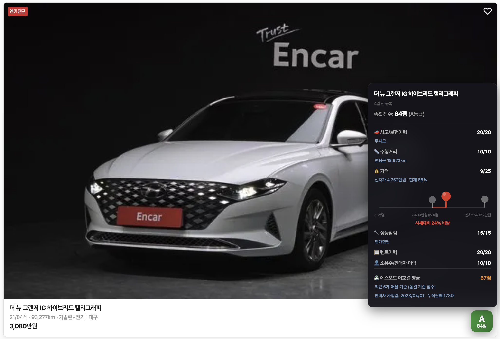

# 엔카 중고차 매물 점수화

> 엔카 중고차 매물을 자동으로 점수화하여 한눈에 비교할 수 있는 Chrome 확장 프로그램


---

## 소개

엔카 웹페이지의 차량 목록 페이지의 각 매물에 **점수 배지(100점 만점)** 를 자동으로 표시합니다. 배지에 마우스를 올리면 항목별 점수 상세 내역을 확인할 수 있고, 기준 점수 미만 매물을 숨기거나 항목별 가중치를 직접 조정할 수 있습니다.





---

## 주요 기능

### 품질 점수 배지 (목록·상세 페이지)
- 각 차량 카드에 **S / A+ / A / B / C / D / F** 등급 배지 자동 표시
- 상세 페이지(`fem.encar.com/cars/detail/*`)에서도 우측 하단 고정 오버레이로 표시
- 배지 호버 시 항목별 점수 툴팁 표시
- **매물 등록 시각** 표시 (N분 전 / N시간 전 / N일 전 / N개월 전)

### 동급매물 시세 비교
- 같은 모델·연식·트림·주행거리 기준으로 실시간 시세 중앙값 조회

### 점수 필터/배점 기준 설정
- 확장 프로그램 팝업에서 차량의 성능과 보험이력을 우선하는 '상태 우선'전략과 저렴한 가격을 우선하는 '가격 우선' 전략 선택 가능
- 설정한 기준 점수 미만 차량을 목록에서 자동으로 숨김 처리
- 슬라이더로 필터 임계값 실시간 조절


> 팝업에서 최소 점수를 설정하면 기준 미만 매물이 즉시 숨겨집니다.

### 가중치 커스터마이징
- 팝업에서 각 평가 항목의 가중치를 슬라이더로 직접 조절
- 저장 / 초기화 및 **프리셋** 지원 (기본형 / 성능 우선 / 가격 우선 등)

### 엔카진단 등급 반영
- 엔카진단 기본 / 엔카진단+ (+2점) / 엔카진단++ (+4점) 가산점 자동 적용

### 판매자(딜러) 정보 제공
- 해당 매물을 등록한 딜러의 **가입일** 및 **누적 판매 대수** 표시
- 해당 딜러의 최근 등록 매물들에 대한 **동일 기준 평균 점수** 조회 기능

---

## 점수 항목 (기본 가중치 합계: 100점)

| 항목 | 기본 점수 | 평가 기준 |
|------|-----------|-----------|
|  가격 | 25점 | 동급 매물 시세 중앙값 대비 비율 (부족 시 연식별 감가율 기반) |
|  사고/보험이력 | 20점 | 최대 단일 사고 규모(신차가 대비 비율), 다중 사고 추가 감점 |
|  렌트이력 | 20점 | 렌트·영업용 사용 이력 여부 |
|  성능점검 | 15점 | 골격·외판 교환·판금·부식 랭크별 감점, 엔카진단 등급 가산점 |
|  주행거리 | 10점 | 출고년월 기준 연간 평균 주행거리 |
|  소유주이력 | 10점 | 소유주 변경 횟수 |

### 등급 기준

| 등급 | 점수 | 의미 |
|------|------|------|
| **S** | 90점 이상 | 최상급 |
| **A+** | 85~89점 | 매우 우수 |
| **A** | 80~84점 | 우수 |
| **B** | 70~79점 | 양호 |
| **C** | 60~69점 | 보통 |
| **D** | 41~59점 | 미흡 |
| **F** | 40점 이하 | 불량 |

---

## 설치 방법

> **현재 Chrome 웹 스토어에 등록되어 있지 않습니다.** 확장 프로그램 파일을 직접 다운로드하여 수동으로 로드해야 합니다.
> 추후 완성도가 충분히 높아지면 웹 스토어 등록을 검토할 예정입니다.

1. 이 페이지 우측 상단 **Code → Download ZIP** 을 클릭하여 파일 다운로드
2. ZIP 파일 압축 해제
3. Chrome에서 주소창에 `chrome://extensions` 입력 후 접속
4. 우측 상단 **개발자 모드** 토글 활성화
5. **압축 해제된 확장 프로그램 로드** 버튼 클릭 → 압축 해제한 폴더 선택
6. 확장 프로그램 목록에 **엔카 중고차 품질 점수** 가 나타나면 설치 완료

---

## 사용 방법

1. 엔카 웹페이지에서 차량 매물 페이지(`https://car.encar.com/list/...`)접속
2. 차량 카드에 자동으로 점수 배지가 표시됨
3. 배지에 마우스를 올려 항목별 점수 상세 확인
4. Chrome 툴바의 확장 아이콘 클릭 → 필터·가중치 조절

---

## 파일 구조

```
├── manifest.json       # 확장 프로그램 설정 (Manifest V3)
├── constants.js        # 기본 가중치 상수
├── scoring/            # 각 평가 항목별 채점 모듈 디렉토리
├── detail-parser.js    # 엔카 API 파싱 및 시세, 딜러 프로필 정보 조회
├── content.js          # 페이지 주입 스크립트 (배지 렌더링·Lazy 로딩)
├── background.js       # Service Worker
├── popup.html/js/css   # 팝업 UI (전략 프리셋 등)
└── styles.css          # 배지·툴팁 오버레이 스타일
```

---

## 문의

버그 리포트, 피드백, 신규 기능 제안 등은 이 저장소의 [Issues](../../issues) 페이지 또는 이메일 hjhjaueon97@gmail.com 으로 보내주시면 감사하겠습니다.

---

## 유의사항

- 점수 배점 기준은 개발자의 주관적인 판단에 따라 산정된 것으로, 실제 차량의 상태나 가치를 객관적으로 대변하지 않습니다. 참고 지표로만 활용하시기 바랍니다.
- 본 프로젝트는 엔카(Encar)와 무관한 개인 사이드 프로젝트이며, 엔카로부터 어떠한 지원·협력·공식 인증도 받지 않았습니다.
- 엔카 웹사이트의 API 구조가 변경될 경우, 본 프로젝트의 기능이 정상적으로 동작하지 않을 수 있습니다.
- 엔카의 PC버전 페이지에서는 동작하지 않으며, 모바일 버전 페이지(`car.encar.com/*`)에서만 동작합니다.
