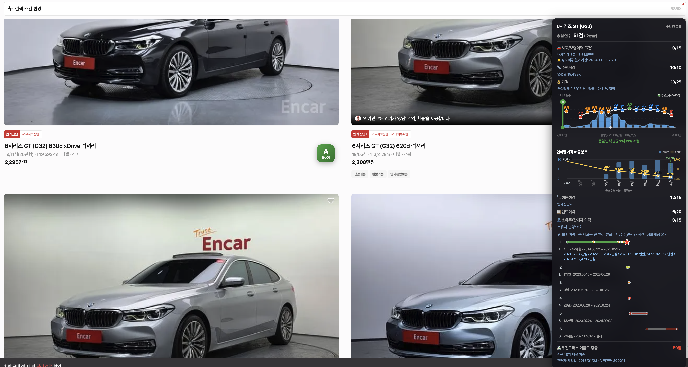

# 엔카 중고차 매물 점수화

> 엔카 중고차 매물을 자동으로 점수화하여 한눈에 비교할 수 있는 Chrome 확장 프로그램


---

## 소개

엔카 웹페이지의 차량 목록 페이지의 각 매물에 **점수 배지(100점 만점)** 를 자동으로 표시합니다. 배지에 마우스를 올리면 항목별 점수 상세 내역을 확인할 수 있고, 기준 점수 미만 매물을 숨기거나 항목별 가중치를 직접 조정할 수 있습니다.





---

## 주요 기능

### 품질 점수 배지 (목록·상세 페이지)
- 각 차량 카드에 **S / A+ / A / B / C / D / F** 등급 배지 자동 표시
- 상세 페이지(`fem.encar.com/cars/detail/*`)에서도 우측 하단 고정 오버레이로 표시
- 배지 호버 시 항목별 점수 툴팁 표시
- **매물 등록 시각** 표시 (N분 전 / N시간 전 / N일 전 / N개월 전)
- **배지 클릭 시 차량 정보 클립보드 복사** — 모델명, 연식, 주행거리(연평균 포함), 가격(신차가·시세 포함), 보험이력(내차피해·타차가해 횟수·금액), 성능점검, 렌트이력, 소유주변경, 딜러 정보를 한 번에 텍스트로 복사

### 동급매물 시세 비교 및 정규분포 히스토그램 시각화
- 같은 모델·트림·주행거리 기준으로 실시간 시세 중앙값 조회 (현재 연식 기준 ±2년 범위 매물 검색)
- **X축(가격대) - Y축(등록 매물 수) 정규분포 히스토그램 차트**: 부드러운 종형 곡선(Bell curve) 배경과 등급(트림)별 누적(Stacked) 히스토그램 바를 통해 시장 매물 밀집 구간 및 최다 분포 가격대를 직관적으로 시각화
- **가격 구간별 평균 품질점수(0~100점)**: 각 구간 매물의 보험·주행거리·가격·성능점검·렌트·소유주 이력을 동일한 사용자 가중치로 채점하여 선과 숫자로 표시
- **최근 1년 판매완료 평균가 (상세 페이지 전용)**: 동일 실제 등록연도·모델·트림의 판매완료 매물에서 당시 광고가격을 수집해 평균과 표본 수를 표시하며, 9,999만원 같은 상담가와 사분위 가격대에서 지나치게 벗어난 아웃라이어는 제외. API 요청량을 줄이기 위해 매물 리스트에서는 조회하지 않고 연식별 최대 400대까지만 분석
- **연식별 평균가격·매물수 복합 차트**: 동일 모델의 같은 파워트레인 트림(예: 30e)을 출고 후 경과 연수(1년 단위)로 묶어 판매 중 평균가(노란 실선), 최근 1년 판매완료 평균가(주황빛 빨간 점선), 등록 매물 수(히스토그램)를 함께 표시하고 선택옵션 포함 신차가를 감가선의 가장 왼쪽 시작값으로 표시. X축에는 경과연수와 2자리 등록연도(YY)를 두 줄로 표기
- **차량 판매가 기준 ~5% 정밀 구간 분할**: 신차가 기준의 과도하게 넓은 구간 대신, 차량 판매가의 약 5% 단위(예: 2,000만원 기준 100만원 단위인 1800~1900, 1900~2000, 2000~2100...)로 정밀 분할하여 실 매물 가격대 집중 분포를 명확히 파악 가능
- **등급별 색상 구분 & 범례(Legend)** 와 **현재 매물 가격 인디케이터 핀**을 통해 현재 차량이 전체 가격 분포 상 어디에 속하는지 명확하게 비교 가능

### 점수 필터/배점 기준 설정
- 확장 프로그램 팝업에서 차량의 성능과 보험이력을 우선하는 '상태 우선'전략과 저렴한 가격을 우선하는 '가격 우선' 전략 선택 가능
- 설정한 기준 점수 미만 차량을 목록에서 자동으로 숨김 처리
- 슬라이더로 필터 임계값 실시간 조절


> 팝업에서 최소 점수를 설정하면 기준 미만 매물이 즉시 숨겨집니다.

### 가중치 커스터마이징
- 팝업에서 각 평가 항목의 가중치를 슬라이더로 직접 조절
- 저장 / 초기화 및 **프리셋** 지원 (기본형 / 성능 우선 / 가격 우선 등)

### 엔카진단 등급 반영
- 엔카진단을 받지 않았을 시, 5점 감점
- **엔카진단을 받지 않은 일반 매물**은 성능점검 점수에서 5점 감점 처리

### 보험이력 세부 정보 표시
- 툴팁에 **내차피해** (횟수 · 보험 지급금액) 및 **타차가해** (횟수 · 보험 지급금액) 세부 표시
- 보험이력의 발생 연월과 보험 지급금액을 당시 소유자의 타임라인 아래에 표시
- 보험이력 발생일을 별표로 표시하고, 사고당 보험 지급금이 신차가의 15% 이상이거나 공임비가 신차가의 7% 이상이면 **큰 사고**로 분류해 큰 빨간 별표로 강조 (그 외는 작은 노란 별표)
- 정보제공 불가기간과 겹치는 소유 기간의 선을 회색으로 표시

### 판매자(딜러) 및 소유주 정보 제공
- 최초 등록일부터 현재까지 소유자별 보유 기간과 변경 이력을 계단형 타임라인으로 표시
- 소유자 순서에 따라 초록색에서 빨간색으로 진해지며, 변경 7회 이상 구간은 검정색으로 표시
- 툴팁이 브라우저 높이를 넘으면 소유주·보험이력 영역을 오른쪽 열로 자동 배치
- 해당 매물을 등록한 딜러의 **가입일** 및 **누적 판매 대수** 표시
- 해당 딜러의 최근 등록 매물들에 대한 **동일 기준 평균 점수** 조회 기능

---

## 점수 항목 (기본 가중치 합계: 100점)

| 항목 | 기본 배점 | 평가 기준 |
|------|:---------:|-----------|
| 가격 | 25점 | 동일 모델·트림의 같은 출고연도 평균가격 대비 비율로 산정 |
| 렌트이력 | 20점 | 렌트 이력 있으면 0점, 용도변경 이력만 있으면 6점, 없으면 만점 |
| 사고/보험이력 | 15점 | 보험 지급금의 신차가 대비 비율로 산정, 다건 사고 추가 감점, 정보불가기간 감점 |
| 성능점검 | 15점 | 골격(A·B랭크)·외판(1·2랭크) 교환·판금·부식 항목별 차등 감점 |
| 소유주이력 | 15점 | 변경 0회 만점 → 1회 -20%, 2회 -47%, 3회 -67%, 4회 이상 0점 |
| 주행거리 | 10점 | 총 주행거리 15만km 초과 시 구간별 감점, 연평균 5천km 미만 과소주행 감점 |

### 세부 채점 기준

<details>
<summary><b>가격 (25점)</b></summary>

**동일 연식 평균가격 비교**:

| 동일 연식 평균 대비 비율 | 점수 |
|:-:|:-:|
| ≤ 85% | 25.0 |
| 85~95% | 22.5 |
| 95~100% | 20.0 |
| 100~105% | 17.5 |
| 105~110% | 15.0 |
| 110~115% | 12.5 |
| 115~125% | 8.75 |
| 125~135% | 5.0 |
| > 135% | 2.5 |

현재 차량과 같은 출고연도의 평균가격 데이터가 없으면 가격 배점의 50%를 부여합니다.

</details>

<details>
<summary><b>사고/보험이력 (15점)</b></summary>

- 무사고: 만점
- 비공개: 0점

**신차가 대비 보험 지급금 비율:**

| 비율 | 점수 |
|:-:|:-:|
| ≤ 8% | 75% (11.25점) |
| 8~15% | 45% (6.75점) |
| > 15% | 10% (1.5점) |

신차가 정보 없을 시 단일 사고 금액 기준 (50만/200만/500만원 구간) 적용.

**추가 감점:**
- 2건 이상: -2점, 4건 이상: -5점
- 정보불가기간 2~6개월: -10점, 6개월 초과: -20점

</details>

<details>
<summary><b>성능점검 (15점)</b></summary>

**엔카진단 적용 매물:** 기본 만점, 프레임교환 -12점, 외판교환 -3점

**일반 성능점검표:**

| 부위 | 교환(X) | 판금/용접(W) | 부식(C) |
|------|:-------:|:----------:|:------:|
| 골격 B랭크 (대시보드·필러·사이드멤버) | -15 | -12 | -2 |
| 골격 A랭크 (리어패널·트렁크플로어) | -10 | -8 | -2 |
| 외판 2랭크 (쿼터·펜더·루프) | -4 | -3 | -2 |
| 외판 1랭크 (도어·트렁크리드·후드) | -1 | -2 | -2 |

**진단 미적용 매물:** 기본 50%(7.5점)에서 -5점 추가 감점

</details>

<details>
<summary><b>주행거리 (10점)</b></summary>

- 15만km 미만: 감점 없음
- 15~20만km: 1만km당 -1점
- 20만km 초과: 1만km당 -2점 (가속 감점)
- 연평균 5천km 미만 과소주행: 1천km당 -2점 추가 감점

</details>

> **정보 비공개 페널티**: 보험이력 또는 성능점검표를 비공개 처리한 매물은 최종 점수에서 **40점이 감점**됩니다.

### 등급 기준

| 등급 | 점수 | 의미 |
|------|------|------|
| **S** | 95점 이상 | 최상급 |
| **A+** | 90~94점 | 매우 우수 |
| **A** | 80~89점 | 우수 |
| **B** | 70~79점 | 양호 |
| **C** | 60~69점 | 보통 |
| **D** | 41~59점 | 미흡 |
| **F** | 40점 이하 | 불량 |

---

## 설치 방법

> **현재 Chrome 웹 스토어에 등록되어 있지 않습니다.** 확장 프로그램 파일을 직접 다운로드하여 수동으로 로드해야 합니다.
> 추후 완성도가 충분히 높아지면 웹 스토어 등록을 검토할 예정입니다.

1. 이 페이지 우측 상단 **Code → Download ZIP** 을 클릭하여 파일 다운로드
2. ZIP 파일 압축 해제
3. Chrome에서 주소창에 `chrome://extensions` 입력 후 접속
4. 우측 상단 **개발자 모드** 토글 활성화
5. **압축 해제된 확장 프로그램 로드** 버튼 클릭 → 압축 해제한 폴더 선택
6. 확장 프로그램 목록에 **엔카 중고차 품질 점수** 가 나타나면 설치 완료

---

## 사용 방법

1. 엔카 웹페이지에서 차량 매물 페이지(`https://car.encar.com/list/...`)접속
2. 차량 카드에 자동으로 점수 배지가 표시됨
3. 배지에 마우스를 올려 항목별 점수 상세 확인
4. 배지를 **클릭**하면 차량 주요 정보가 클립보드에 복사됨
5. Chrome 툴바의 확장 아이콘 클릭 → 필터·가중치 조절

---

## 파일 구조

```
├── manifest.json       # 확장 프로그램 설정 (Manifest V3)
├── constants.js        # 기본 가중치 상수
├── scoring/            # 각 평가 항목별 채점 모듈 디렉토리
├── detail-parser.js    # 차량 상세·시세·연식별 데이터 파싱 및 조회 조정
├── content.js          # 배지·가격 히스토그램·연식별 차트 렌더링
├── background.js       # 판매완료 HTML 조회 및 OpenAI Service Worker
├── popup.html/js/css   # 팝업 UI (전략 프리셋 등)
└── styles.css          # 배지·툴팁 오버레이 스타일
```

---

## 문의

버그 리포트, 피드백, 신규 기능 제안 등은 이 저장소의 [Issues](../../issues) 페이지 또는 이메일 hjhjaueon97@gmail.com 으로 보내주시면 감사하겠습니다.

---

## 유의사항

- 점수 배점 기준은 개발자의 주관적인 판단에 따라 산정된 것으로, 실제 차량의 상태나 가치를 객관적으로 대변하지 않습니다. 참고 지표로만 활용하시기 바랍니다.
- 본 프로젝트는 엔카(Encar)와 무관한 개인 사이드 프로젝트이며, 엔카로부터 어떠한 지원·협력·공식 인증도 받지 않았습니다.
- 엔카 웹사이트의 API 구조가 변경될 경우, 본 프로젝트의 기능이 정상적으로 동작하지 않을 수 있습니다.
- 엔카의 PC버전 페이지에서는 동작하지 않으며, 모바일 버전 페이지(`car.encar.com/*`)에서만 동작합니다.
- 간혹 등급표가 나타나지 않는 경우가 있습니다. 이 경우 새로고침 후 다시 시도해주세요.

## 업데이트 기록

### 2026-09-11
- 소유자별 보유 기간과 소유주 변경일을 계단형 타임라인으로 시각화
- 보험이력 발생 연월과 지급금액을 해당 소유 기간에 연결해 표시
- 보험 지급금·공임비의 신차가 대비 비율로 큰 사고를 분류하고 사고일을 크기와 색상이 다른 별표로 표시
- 정보제공 불가기간과 겹치는 타임라인 구간을 회색으로 구분
- 내용이 뷰포트보다 길면 소유주·보험이력 영역을 오른쪽 열로 옮기는 반응형 배치 추가

### 2026-09-08
- 가격 구간별 등록 매물 수와 평균 품질점수(0~100점)를 함께 표시하는 히스토그램 추가
- 모델·세대·트림 검색을 정밀화하고 `30e`, `30d`, `30i` 등 파워트레인 단위로 분리 집계
- 출고 후 경과 연수별 판매 중 평균가격·매물 수 복합 차트 및 신차가 시작점 추가
- 최근 1년 판매완료 당시 광고가격을 연식별로 조회해 주황빛 빨간 점선으로 비교 표시
- 9,999만원 상담가와 IQR 범위를 크게 벗어난 판매완료 가격을 평균에서 제외
- 판매완료 분석을 상세 페이지로 제한하고 동시 요청 수·연식별 조회 페이지에 상한 적용
- 가격 배점을 현재 차량과 동일한 실제 등록연도의 평균가격 기준으로 변경
- 툴팁 폭과 차트 내부 영역을 확대하고 조밀한 가격 라벨 축약·레이어 순서 개선

### 2026-03-11
- AI 분석 응답을 스트리밍(실시간 타이핑) 방식으로 변경
- AI 분석 모달 크기 확대 (너비 520→640px, 본문 최대 높이 520→640px)
- 등급 기준 조정: S 95점 이상, A+ 90~94점, A 80~89점
- README 점수 항목 세부 채점표 실제 코드 기준으로 전면 갱신

### 2026-03-09
- 배지 클릭 시 차량 주요 정보 클립보드 복사 기능 추가
- 툴팁에 내차피해(횟수·금액) / 타차가해(횟수·금액) 세부 항목 표시
- content.js 역할별 섹션 구조 정리 및 툴팁 UI 개선
- 배지 클릭 시 액션 메뉴(클립보드 복사 / AI 분석) 표시로 UX 개선
- OpenAI API 연동: 매물 정보를 기반으로 AI 구매 분석 기능 추가
- AI 분석 결과를 localStorage에 캐시하여 재요청 없이 재조회 가능
- AI 분석 캐시 보유 매물 배지에 초록색 점 표시
- 팝업에 OpenAI API 키 입력·저장 UI 추가

### 2026-03-08
- 보험이력·성능점검 비공개 매물에 40점 페널티 적용
- 엔카진단 등급(+/++) 파싱 및 점수 반영
- 소유주 변경 횟수 파싱·표시 및 점수 반영
- 딜러 정보(가입일·누적 판매대수) 및 딜러 최근 매물 평균 점수 조회 기능 추가
- 카드 Lazy-load 처리 및 API 요청 횟수 최적화

### 2026-03-07
- 채점 로직을 scoring/ 디렉토리 리팩토링
- 주행거리 채점 기준 세분화 (연식별 기준 강화)
- 엔카진단 파싱·채점·UI 표시 기능 추가
- 가격 시세 미터 SVG 시각화 개선 (신차가·동적 스케일)
- 데모 영상·이미지 추가 및 README 갱신

### 2026-03-06
- 출고 월 기준 연평균 주행거리 계산
- 상세 페이지(`fem.encar.com/cars/detail/*`) 점수 배지 오버레이 추가
- 동급 매물 시세 중앙값 조회 및 SVG 가격 편차 미터 표시
- A+ / F 등급 추가 및 등급 구간 조정

### 2026-03-05
- 보험이력 정보 제공 불가 기간 파싱 및 툴팁 경고 표시
- 최초 배포
