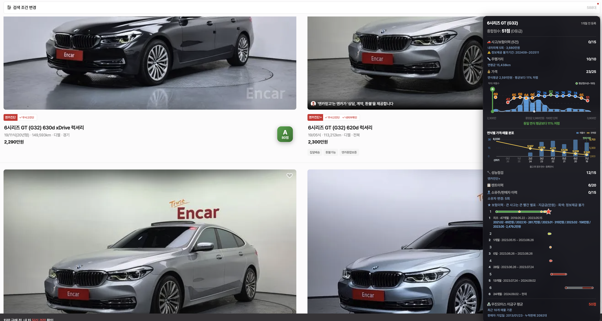

# 엔카 중고차 매물 점수화

> 엔카 중고차 매물을 자동으로 점수화하여 한눈에 비교할 수 있는 Chrome 확장 프로그램


---

## 소개

엔카 웹페이지의 차량 목록 페이지의 각 매물에 **점수 배지(100점 만점)** 를 자동으로 표시합니다. 배지에 마우스를 올리면 항목별 점수 상세 내역을 확인할 수 있고, 기준 점수 미만 매물을 숨기거나 항목별 가중치를 직접 조정할 수 있습니다.





---

## 주요 기능

### 품질 점수 배지 (목록·상세 페이지)
- 각 차량 카드에 **S / A+ / A / B / C / D / F** 등급 배지 자동 표시
- 상세 페이지(`fem.encar.com/cars/detail/*`)에서도 우측 하단 고정 오버레이로 표시
- 배지 호버 시 항목별 점수 툴팁 표시
- **매물 등록 시각** 표시 (N분 전 / N시간 전 / N일 전 / N개월 전)
- **신규 매물 N 표시**: 현재 광고 등록(`firstAdvertisedDateTime`) 후 7일(168시간) 이내인 매물은 점수 박스 오른쪽 위에 작은 빨간 `N` 표시. 목록·상세 페이지 공통이며 추가 API 요청 없음. 시간대 없는 등록 시각은 한국 시간 기준으로 해석하고 날짜 미확인·잘못된 날짜·미래 날짜에는 표시하지 않음. 배지를 생성/갱신하는 시점에 판정하며 재등록 차량도 현재 광고 등록일 기준
- **배지 클릭 시 차량 정보 클립보드 복사** — 모델명, 연식, 주행거리(연평균 포함), 가격(신차가·시세 포함), 보험이력(내차피해·타차가해 횟수·금액), 성능점검, 렌트이력, 소유주변경, 딜러 정보를 한 번에 텍스트로 복사

### 동급매물 시세 비교 및 정규분포 히스토그램 시각화
- 같은 모델·트림·주행거리 기준으로 실시간 시세 중앙값 조회 (현재 연식 기준 ±2년 범위 매물 검색)
- 가격 분포 차트·가격 구간별 평균 점수·딜러 평균 점수는 툴팁을 처음 열 때 불러와 채움(목록 배지를 빠르게 띄우고 엔카 검색 API의 요청 제한을 피하기 위함, 상세 페이지는 바로 미리 불러옴)
- **X축(가격대) - Y축(등록 매물 수) 정규분포 히스토그램 차트**: 부드러운 종형 곡선(Bell curve) 배경과 등급(트림)별 누적(Stacked) 히스토그램 바를 통해 시장 매물 밀집 구간 및 최다 분포 가격대를 직관적으로 시각화
- **차량 판매가 기준 ~5% 정밀 구간 분할**: 신차가 기준의 과도하게 넓은 구간 대신, 차량 판매가의 약 5% 단위(예: 2,000만원 기준 100만원 단위인 1800~1900, 1900~2000, 2000~2100...)로 정밀 분할하여 실 매물 가격대 집중 분포를 명확히 파악 가능
- **등급별 색상 구분 & 범례(Legend)** 와 **현재 매물 가격 인디케이터 핀**을 통해 현재 차량이 전체 가격 분포 상 어디에 속하는지 명확하게 비교 가능
- **가격 구간별 평균 품질점수(0~100점)**: 각 구간 매물의 보험·주행거리·가격·성능점검·렌트·소유주 이력을 동일한 사용자 가중치로 채점하여 선과 숫자로 표시
- **연식별 평균가격·매물수 복합 차트**: 동일 모델의 같은 파워트레인 트림(예: 30e)을 출고 후 경과 연수(1년 단위)로 묶어 판매 중 평균가(노란 실선)와 등록 매물 수(히스토그램)를 표시하고 선택옵션 포함 신차가를 감가선의 가장 왼쪽 시작값으로 표시. X축에는 경과연수와 2자리 등록연도(YY)를 두 줄로 표기. 감가곡선을 추정하면 추정 곡선(주황 점선)과 현재 차량 위치(초록 점)를 겹쳐 그림

### 감가 현황
같은 모델의 여러 연식 매물로 감가곡선을 추정하고, **신차가(옵션 포함)를 100%로 둔 막대**로 현재 가치와 앞으로 1년간 예상되는 감가를 보여줍니다.

- **초록색**: 1년 후에도 남을 것으로 추정되는 가치. 예측 조회 전에는 현재 가치를 표시
- **주황색**: 현재 가치 중 앞으로 1년간 감가될 것으로 예상되는 부분. 초록색 + 주황색이 현재 가치
- **회색**: 신차가에서 이미 감가된 부분
- 예: 신차가 5,000만원, 현재가 3,500만원, 1년 예상 감가 500만원이면 **초록 60% + 주황 10% + 회색 30%**. 주황색을 기존 감가에 중복 합산하지 않음
- 현재 가치·누적 감가 막대는 예측을 기다리지 않고 표시. 추정 불가/조회 실패 시에도 막대를 유지하되 주황색 예상 구간은 표시하지 않음. 신차가가 없으면 비율을 만들지 않고 안내 및 예상 금액만 표시. 현재가가 신차가를 초과하면 막대·범례는 100% 범위만 표시하고 초과 안내 추가
- 막대 아래에 **`1년 예상 감가 N만원 · 1년 후 예상가 M만원`** 표시. **1년 후 예상가** = 현재가 − 1년간 예상 하락액. 상세 비율·근거는 막대/ⓘ 마우스오버와 클립보드·AI 분석 텍스트에서 확인 가능
- **감가 단계** (신차가 대비 연 하락 비율 기준)

  | 단계 | 신차가 대비 | 주로 해당하는 연식 |
  |------|:---:|:---:|
  | 가파른 감가 | 6.5% 이상 | 출고 3년 안팎 |
  | 평균적 감가 | 4~6.5% | 6년 안팎 |
  | 완만한 감가 | 2.5~4% | 11년 안팎 |
  | 감가 둔화 | 2.5% 미만 | 15년 이상 |

- ⓘ에 마우스를 올리면 출고 연수·신차가·현재가·1년 후 예상가와 현재가 대비 연 감가율(연식 감가 + 주행 감가), 추정에 쓴 매물 수, 주행 1만km당 하락률이 표시됨. 클립보드 복사·AI 분석에도 포함
- 목록·상세 페이지 모두 툴팁을 처음 열 때 조회하며, 모델 그룹별 결과를 24시간 캐시
- 종합점수에는 반영하지 않음

<details>
<summary><b>감가곡선 추정 방식</b></summary>

- 같은 모델 그룹(예: 그랜저 전 세대·전 트림)의 판매 중 매물을 최근 수정순 최대 2,000대(요청 4회) 받아 회귀. 렌트·리스, 중복 광고, 상담가(9,999만원)는 제외
- `log(가격) = 세대·트림별 기준값 + 경과연수 구간 기울기 + 주행거리 계수 × 주행거리`. 세대·트림 기준값이 가격 수준 차이를 흡수해 여러 세대를 합친 0~20년 곡선을 얻음
- 곡선은 오래될수록 오르지 않도록 단조 감소로 제한하고, 인접 구간 기울기 차이에 벌점을 줘 세대 교체 잡음을 줄임. Huber 가중치로 이상치 영향 완화
- 1년간 예상 하락 = 이 차량 경과연수에서의 곡선 기울기(연식 감가) + 모델 평균 연간 주행거리만큼의 하락(주행 감가). 지금까지의 주행 이력은 현재 가격에 이미 반영돼 있으므로 이 차량의 과거 주행 패턴은 이어 붙이지 않음
- 감가 단계는 현재가 대비 비율이 아닌 신차가 대비 비율로 판단. 현재가 대비로는 15년 넘은 300만원대 차도 연 9~14%로 나오기 때문. 기준값은 9개 모델 그룹 매물 2.8만 대의 분포(약 20% / 48% / 28% / 4%)로 정함. 신차가 정보가 없으면 단계 없이 예상가만 표시
- 회귀 표본(매물 5대 이상인 세대·트림) 150대 미만이거나 연식 범위가 4년 미만인 모델 그룹은 추정하지 않고 사유(`표본 부족`/`연식 범위 부족`) 표시. 표본 150대에서 전체 표본 곡선 대비 오차 중앙값은 1~3%p
- 표본 500대 미만이면 매물을 복원추출해 50번 다시 추정한 90% 범위를 ⓘ 설명에 함께 표시
- 같은 시점의 여러 연식을 비교한 곡선이므로 한 차량의 실제 가격 추이가 아니며, 신차 → 1년차 첫 감가, 연식별 신차가 인상, 중고차 시세 전체 변동은 반영하지 않음. 세대별로 곡선 모양이 다를 수 있으나 같은 모양으로 가정. 16년 이상은 표본이 적어 앞 구간 기울기를 이어 쓴 추정일 수 있음

</details>

### 거래 현황 (상세 페이지 전용)
- 가격 차트 아래에 최근 30일 판매완료 기록 건수와 현재 매물 수 표시. 출고/등록연도에 관계없이 동일 모델 세대·정확한 세부 트림의 모든 연식을 합산. 다른 세대나 파워트레인은 섞지 않으며 차트의 파워트레인 묶음보다 범위가 좁을 수 있음. 가격 유무나 가격 이상치와 무관하게 판매일을 집계하고 현재 매물의 중복 광고는 제외
- 판매완료 가격 열이 제공되지 않아 기존 판매완료 평균가 줄과 연식 차트 점선은 제거

<details>
<summary><b>거래 현황 집계 정책</b></summary>

- 한국 날짜 기준 오늘 포함 최근 30일 실제 판매완료 기록을 집계(90일 건수 / 3 평균이 아님). 현재 판매 중(파랑)과 판매완료(빨강)를 하나의 비율 막대로 표시. 비율은 두 건수 합계 대비 비중으로 판매확률이 아님. 부분 집계/전체 0건에는 비율 막대를 표시하지 않음
- 제목 줄 왼쪽에 `거래 현황 (최근 30일 기준)`, 오른쪽에 `N건` 표시: 현재 판매 중 + 최근 30일 판매완료. 예: 현재 50대 + 판매완료 20건 = 합계 70건. 신규 등록 대수나 중복을 제거한 고유 차량 수는 아니므로 `대` 대신 `건` 사용. 부분 집계는 `이상 · 집계 일부`를 함께 표시하며 기존 하단 합계 줄·재고 소진 일수·일/30일 평균 행은 제거
- 매물 합계의 마우스오버 설명 및 복사·AI 입력에 집계 범위와 주의사항 포함. 화면 하단의 긴 설명 문구는 표시하지 않음
- 판매완료는 차량 ID로 필터 코드를 확인한 뒤 연식 조건을 비운 코드 검색으로 재조회. 응답의 모델·트림·연식 제한 해제 여부를 검증. 현재 매물 검색도 연도 조건 없이 조회
- 판매완료 최대 20페이지(400건), 현재 후보 매물 최대 5,000건. 범위를 전부 확인하지 못하면 건수·합계는 `이상`/`집계 일부`로 표시하고 비율은 숨김
- 목록 페이지에서는 요청하지 않음. 상세 툴팁을 처음 열 때 조회. 모델·세부 트림·조회 기준일별 워커 생존 중 최대 30분 캐시 및 페이지 내 배지별 30분 재조회 억제. 연식이 달라도 같은 범위의 캐시 공유. 워커 종료 시 캐시는 사라지며 캐시 확인 전 상세 API 1회 호출. 실패 시 다음 툴팁 열기에서 재시도
- 조회 후 클립보드와 AI 분석 입력에도 범위·집계 상태·주의사항을 포함. 종합점수나 인기 등급에는 반영하지 않음
- 판매완료 기록의 중복·실제 거래 여부와 현재 재고/판매완료의 렌트·리스 포함 범위 일치는 미검증. 현재 매물에서만 렌트·리스를 임의로 제외하지 않음

</details>

### 점수 필터/배점 기준 설정
- 확장 프로그램 팝업에서 차량의 성능과 보험이력을 우선하는 '상태 우선'전략과 저렴한 가격을 우선하는 '가격 우선' 전략 선택 가능
- 설정한 기준 점수 미만 차량을 목록에서 자동으로 숨김 처리
- 슬라이더로 필터 임계값 실시간 조절


> 팝업에서 최소 점수를 설정하면 기준 미만 매물이 즉시 숨겨집니다.

### 가중치 커스터마이징
- 팝업에서 각 평가 항목의 가중치를 슬라이더로 직접 조절
- 슬라이더 조작을 마치면 자동 저장(`change` 이벤트, 별도 저장 버튼도 유지). 저장소에서 값을 다시 읽어 일치할 때만 `저장 확인 완료` 표시. 저장 실패·불러오기 실패는 오류를 표시하며 성공으로 처리하지 않음
- 초기 설정 로드와 저장 확인 중에는 배점 컨트롤을 잠가 이전 값/기본값의 덮어쓰기를 방지. 팝업을 닫았다 열어도 저장된 배점(0점 포함) 유지
- 저장 / 초기화 및 **프리셋** 지원 (기본형 / 성능 우선 / 가격 우선 등)
- 저장·초기화·프리셋을 적용하면 열려 있는 페이지의 점수 배지, 가격 구간별 평균 점수, 딜러 평균 점수, 최소 점수 필터가 데이터를 다시 받지 않고 즉시 다시 계산됨
- 확장 프로그램 업데이트/재로드 시 저장한 배점·최소 점수 필터를 유지하고 없는 설정만 기본값으로 보충. 연속 저장 시 마지막 배점만 반영하여 늦게 끝난 이전 재계산이 최신 점수를 덮지 않도록 처리

### 엔카진단 등급 반영
- 엔카진단을 받지 않았을 시, 5점 감점
- **엔카진단을 받지 않은 일반 매물**은 성능점검 점수에서 5점 감점 처리

### 보험이력 세부 정보 표시
- 툴팁에 **내차피해** (횟수 · 보험 지급금액) 및 **타차가해** (횟수 · 보험 지급금액) 세부 표시
- 보험이력의 발생 연월과 보험 지급금액을 당시 소유자의 타임라인 아래에 표시
- 보험이력 발생일을 별표로 표시하고, 사고당 보험 지급금이 신차가의 15% 이상이거나 공임비가 신차가의 7% 이상이면 **큰 사고**로 분류해 큰 빨간 별표로 강조 (그 외는 작은 노란 별표)
- 정보제공 불가기간과 겹치는 소유 기간의 선을 회색으로 표시

### 판매자(딜러) 및 소유주 정보 제공

- 최초 등록일부터 현재까지 소유자별 보유 기간과 변경 이력을 계단형 타임라인으로 표시
- 원본 변경 횟수 아래 **`딜러 경유 보정 시 N회 추정`** 안내 추가. 원본 횟수·타임라인·보험이력과 소유주 점수는 그대로 유지하며, 추정 문구는 클립보드·AI 분석에도 포함. 기존 데이터만 사용하므로 추가 API 요청 없음
- 현재 딜러 판매(`contact.userType = DEALER`)이고 마지막 변경이 엔카 등록일(`manage.registDateTime`, 광고 재등록일 아님) 전 0~30일이면 현재 매입 후보 1회 제외
- 과거 변경은 **묶음 전체가 30일 이내**일 때 여러 건을 1회로 추정. 인접 간격이 짧아도 전체 30일을 넘는 연쇄는 나눠 묶지 않고 보류. 31~60일 간격은 원본 앞뒤 변경과 각각 60일 초과 떨어진 독립된 두 건만 묶음. 동일 날짜 기록도 보존하며 기록 재사용·묶음 재병합 없음
- 등록 이후 변경과 등록 전 31~90일의 마지막 변경은 현재 딜러 매입이라는 이유만으로 제외하지 않음. 판매자 유형은 현재 매입 후보 판단에만 사용. 과거 거래 묶음 판단은 별도 적용
- 날짜/횟수 누락·불일치·날짜 오류·비공개는 `추정 불가`, 해석이 어려운 연쇄는 `판정 보류` 또는 `일부 판정 보류` 표시. 보류한 변경은 원본 횟수대로 유지. 문구에 마우스를 올리면 보정 근거와 주의사항 표시. 날짜 기반의 미검증 추정이며 0회여도 **1인 소유 확인을 의미하지 않음**
- 소유자 순서에 따라 초록색에서 빨간색으로 진해지며, 변경 7회 이상 구간은 검정색으로 표시
- 툴팁이 브라우저 높이를 넘으면 소유주·보험이력 영역을 오른쪽 열로 자동 배치
- 해당 매물을 등록한 딜러의 **가입일** 및 **누적 판매 대수** 표시
- 해당 딜러의 최근 등록 매물들에 대한 **동일 기준 평균 점수** 조회 기능

---

## 점수 항목 (기본 가중치 합계: 100점)

| 항목 | 기본 배점 | 평가 기준 |
|------|:---------:|-----------|
| 가격 | 25점 | 동일 모델·트림의 같은 출고연도 평균가격 대비 비율로 산정 |
| 렌트이력 | 20점 | 렌트 이력 있으면 0점, 용도변경 이력만 있으면 6점, 없으면 만점 |
| 사고/보험이력 | 15점 | 보험 지급금의 신차가 대비 비율로 산정, 다건 사고 추가 감점, 정보불가기간 감점 |
| 성능점검 | 15점 | 골격(A·B랭크)·외판(1·2랭크) 교환·판금·부식 항목별 차등 감점 |
| 소유주이력 | 15점 | 변경 0회 만점 → 1회 -20%, 2회 -47%, 3회 -67%, 4회 이상 0점 |
| 주행거리 | 10점 | 총 주행거리 15만km 초과 시 구간별 감점, 연평균 5천km 미만 과소주행 감점 |

용도변경은 `carInfoUse1s`에 서로 다른 코드가 있을 때만 판정합니다. `["2", "2"]`처럼 같은 코드가 반복된 경우에는 용도변경 감점 없이 렌트이력 항목의 만점을 유지합니다. 기존 렌트이력 판정·감점 기준은 그대로 적용합니다.

### 세부 채점 기준

<details>
<summary><b>가격 (25점)</b></summary>

**동일 연식 평균가격 비교**:

| 동일 연식 평균 대비 비율 | 점수 |
|:-:|:-:|
| ≤ 85% | 25.0 |
| 85~95% | 22.5 |
| 95~100% | 20.0 |
| 100~105% | 17.5 |
| 105~110% | 15.0 |
| 110~115% | 12.5 |
| 115~125% | 8.75 |
| 125~135% | 5.0 |
| > 135% | 2.5 |

현재 차량과 같은 출고연도의 평균가격 데이터가 없으면 가격 배점의 50%를 부여합니다.

</details>

<details>
<summary><b>사고/보험이력 (15점)</b></summary>

- 무사고: 만점
- 비공개: 0점

**신차가 대비 보험 지급금 비율:**

| 비율 | 점수 |
|:-:|:-:|
| ≤ 8% | 75% (11.25점) |
| 8~15% | 45% (6.75점) |
| > 15% | 10% (1.5점) |

신차가 정보 없을 시 단일 사고 금액 기준 (50만/200만/500만원 구간) 적용.

**추가 감점:**
- 2건 이상: -2점, 4건 이상: -5점
- 정보불가기간 2~6개월: -10점, 6개월 초과: -20점

</details>

<details>
<summary><b>성능점검 (15점)</b></summary>

**사고·수리 기록 감점이 엔카진단보다 우선합니다.** 엔카진단은 외판 교환 여부만 판정하므로, 진단 매물도 성능점검표의 교환·판금·부식을 먼저 감점합니다.

**성능점검표 (엔카진단 여부와 무관하게 항상 적용):**

| 부위 | 교환(X) | 판금/용접(W·WC) | 부식(C) |
|------|:-------:|:----------:|:------:|
| 골격 B랭크 (대시보드·필러·사이드멤버) | -15 | -12 | -2 |
| 골격 A랭크 (리어패널·트렁크플로어) | -10 | -8 | -2 |
| 외판 2랭크 (쿼터·펜더·루프) | -4 | -3 | -2 |
| 외판 1랭크 (도어·트렁크리드·후드) | -1 | -2 | -2 |

**엔카진단:**
- 진단의 프레임 교환(-12점)·외판 교환(-3점) 판정은 성능점검표에 같은 종류의 교환 기록이 없을 때만 감점 (같은 수리를 두 번 감점하지 않음)
- 엔카진단++는 사고·수리 감점이 없는 차량에만 +4점 (감점을 상쇄하지 않음)
- 엔카진단 미적용 매물은 -5점

성능점검표와 엔카진단이 모두 없으면 기본 50%(7.5점)에서 -5점을 감점합니다.

</details>

<details>
<summary><b>주행거리 (10점)</b></summary>

- 15만km 미만: 감점 없음
- 15~20만km: 1만km당 -1점
- 20만km 초과: 1만km당 -2점 (가속 감점)
- 연평균 5천km 미만 과소주행: 1천km당 -2점 추가 감점

</details>

> **정보 비공개 페널티**: 보험이력 또는 성능점검표를 비공개 처리한 매물은 최종 점수에서 **40점이 감점**됩니다.

> **용접·절단 페널티**: 성능점검표에 **용접·절단** 기록(쿼터·사이드실 패널 등 차체에 용접된 패널을 잘라내고 다시 붙인 수리)이 있으면 부위 수와 관계없이 최종 점수에서 **30점이 감점**되고, 툴팁의 사고/보험이력 아래에 빨간 경고로 표시됩니다. 용접·절단 부위는 성능점검 판금 감점에도 포함됩니다.

> **전손·침수 페널티**: 보험이력에 **전손** 또는 **침수(전손·분손)** 기록이 있거나 성능점검표에 침수로 표시된 매물은 최종 점수에서 **30점이 감점**되고(전손·침수가 함께 있어도 1회), 툴팁의 사고/보험이력 아래에 종류·횟수·날짜가 빨간 경고로 표시됩니다. 보험이력이 비공개면 알 수 없으므로 비공개 페널티만 적용됩니다.

### 등급 기준

| 등급 | 점수 | 의미 |
|------|------|------|
| **S** | 95점 이상 | 최상급 |
| **A+** | 90~94점 | 매우 우수 |
| **A** | 80~89점 | 우수 |
| **B** | 70~79점 | 양호 |
| **C** | 60~69점 | 보통 |
| **D** | 41~59점 | 미흡 |
| **F** | 40점 이하 | 불량 |

---

## 설치 방법

> **현재 Chrome 웹 스토어에 등록되어 있지 않습니다.** 확장 프로그램 파일을 직접 다운로드하여 수동으로 로드해야 합니다.
> 추후 완성도가 충분히 높아지면 웹 스토어 등록을 검토할 예정입니다.

1. 이 페이지 우측 상단 **Code → Download ZIP** 을 클릭하여 파일 다운로드
2. ZIP 파일 압축 해제
3. Chrome에서 주소창에 `chrome://extensions` 입력 후 접속
4. 우측 상단 **개발자 모드** 토글 활성화
5. **압축 해제된 확장 프로그램 로드** 버튼 클릭 → 압축 해제한 폴더 선택
6. 확장 프로그램 목록에 **엔카 중고차 품질 점수** 가 나타나면 설치 완료

---

## 사용 방법

1. 엔카 웹페이지에서 차량 매물 페이지(`https://car.encar.com/list/...`)접속
2. 차량 카드에 자동으로 점수 배지가 표시됨
3. 배지에 마우스를 올려 항목별 점수 상세 확인
4. 배지를 **클릭**하면 차량 주요 정보가 클립보드에 복사됨
5. Chrome 툴바의 확장 아이콘 클릭 → 필터·가중치 조절

---

## 파일 구조

```
├── manifest.json       # 확장 프로그램 설정 (Manifest V3)
├── constants.js        # 기본 가중치 상수
├── scoring/            # 각 평가 항목별 채점 모듈 디렉토리
├── detail-parser.js    # 차량 상세·시세·연식별 데이터 파싱 및 조회 조정
├── depreciation.js     # 모델 그룹 매물 회귀로 감가곡선 추정·1년 후 예상가 계산
├── owner-history.js    # 원본·점수를 보존하는 딜러 경유 변경 횟수 추정 안내
├── content.js          # 배지·가격 히스토그램·연식별 차트·감가/거래 현황 렌더링
├── background.js       # 판매완료 HTML 조회(거래 현황) 및 OpenAI Service Worker
├── popup.html/js/css   # 팝업 UI (전략 프리셋 등)
├── styles.css          # 배지·툴팁 오버레이 스타일
└── tests/              # 감가곡선·거래 현황 자동 테스트 (`node --test tests/`)
```

---

## 문의

버그 리포트, 피드백, 신규 기능 제안 등은 이 저장소의 [Issues](../../issues) 페이지 또는 이메일 hjhjaueon97@gmail.com 으로 보내주시면 감사하겠습니다.

---

## 유의사항

- 점수 배점 기준은 개발자의 주관적인 판단에 따라 산정된 것으로, 실제 차량의 상태나 가치를 객관적으로 대변하지 않습니다. 참고 지표로만 활용하시기 바랍니다.
- 본 프로젝트는 엔카(Encar)와 무관한 개인 사이드 프로젝트이며, 엔카로부터 어떠한 지원·협력·공식 인증도 받지 않았습니다.
- 엔카 웹사이트의 API 구조가 변경될 경우, 본 프로젝트의 기능이 정상적으로 동작하지 않을 수 있습니다.
- 엔카의 PC버전 페이지에서는 동작하지 않으며, 모바일 버전 페이지(`car.encar.com/*`)에서만 동작합니다.
- 간혹 등급표가 나타나지 않는 경우가 있습니다. 이 경우 새로고침 후 다시 시도해주세요.

## 업데이트 기록

### 2026-10-05

- 감가 현황을 신차가 100% 기준의 초록(잔존 가치)·주황(1년 예상 감가)·회색(누적 감가) 막대로 변경. 현재 가치는 즉시 표시하고 예측 후 해당 부분을 나눠 표시. 막대 아래에는 기준 문구 대신 1년 예상 감가액·예상가 표시. 기존 감가 계산·API 요청·점수는 유지하며 상세 근거는 마우스오버/복사로 제공

### 2026-10-03

- 원본 소유자 변경 횟수·타임라인·점수는 유지하고 딜러 경유 보정 시 변경 횟수를 추정 안내(이슈 #2). 추가 API 요청 없이 등록일·변경일로 계산하며 추정 불가·판정 보류와 근거 설명 제공

### 2026-09-29
- 툴팁에 **감가 현황** 추가: `1년 후 예상가 N만원 (-M만원, 신차가 대비 X%)`와 4단계(가파른 감가 · 평균적 감가 · 완만한 감가 · 감가 둔화) 표시
- 같은 모델 그룹의 여러 세대·연식 매물을 회귀해 감가곡선을 추정하고 연식별 차트에 추정 곡선과 현재 차량 위치 표시
- 감가 단계는 신차가 대비 하락 비율로 판단해 15년 넘은 저가 차량이 '가파른 감가'로 나오지 않도록 함
- 표본이 적은 모델(150~500대)도 추정하고 90% 범위를 함께 제공, 추정 불가 시 사유 표시
- 클립보드·AI 분석 텍스트에 감가 정보 포함

### 2026-09-24
- 상세 페이지 전용 거래 현황 추가: 가격 없는 판매완료 기록도 최근 90일 건수 집계
- 판매완료 평균가 줄·연식 차트 점선을 제거하고 거래량/재고 대비 회전으로 분리 표시
- 재고 소진 일수 대신 최근 판매량 대비 재고의 개월분 표시. 표본 부족·부분 집계 시 회전 판단 보류
- 미검증 상대등급은 표시하지 않고 비교 기준 미검증 안내. 클립보드·AI 입력에도 동일 주의사항 반영

### 2026-09-11
- 소유자별 보유 기간과 소유주 변경일을 계단형 타임라인으로 시각화
- 보험이력 발생 연월과 지급금액을 해당 소유 기간에 연결해 표시
- 보험 지급금·공임비의 신차가 대비 비율로 큰 사고를 분류하고 사고일을 크기와 색상이 다른 별표로 표시
- 정보제공 불가기간과 겹치는 타임라인 구간을 회색으로 구분
- 내용이 뷰포트보다 길면 소유주·보험이력 영역을 오른쪽 열로 옮기는 반응형 배치 추가

### 2026-09-08
- 가격 구간별 등록 매물 수와 평균 품질점수(0~100점)를 함께 표시하는 히스토그램 추가
- 모델·세대·트림 검색을 정밀화하고 `30e`, `30d`, `30i` 등 파워트레인 단위로 분리 집계
- 출고 후 경과 연수별 판매 중 평균가격·매물 수 복합 차트 및 신차가 시작점 추가
- 최근 1년 판매완료 당시 광고가격을 연식별로 조회해 주황빛 빨간 점선으로 비교 표시
- 9,999만원 상담가와 IQR 범위를 크게 벗어난 판매완료 가격을 평균에서 제외
- 판매완료 분석을 상세 페이지로 제한하고 동시 요청 수·연식별 조회 페이지에 상한 적용
- 가격 배점을 현재 차량과 동일한 실제 등록연도의 평균가격 기준으로 변경
- 툴팁 폭과 차트 내부 영역을 확대하고 조밀한 가격 라벨 축약·레이어 순서 개선

### 2026-03-11
- AI 분석 응답을 스트리밍(실시간 타이핑) 방식으로 변경
- AI 분석 모달 크기 확대 (너비 520→640px, 본문 최대 높이 520→640px)
- 등급 기준 조정: S 95점 이상, A+ 90~94점, A 80~89점
- README 점수 항목 세부 채점표 실제 코드 기준으로 전면 갱신

### 2026-03-09
- 배지 클릭 시 차량 주요 정보 클립보드 복사 기능 추가
- 툴팁에 내차피해(횟수·금액) / 타차가해(횟수·금액) 세부 항목 표시
- content.js 역할별 섹션 구조 정리 및 툴팁 UI 개선
- 배지 클릭 시 액션 메뉴(클립보드 복사 / AI 분석) 표시로 UX 개선
- OpenAI API 연동: 매물 정보를 기반으로 AI 구매 분석 기능 추가
- AI 분석 결과를 localStorage에 캐시하여 재요청 없이 재조회 가능
- AI 분석 캐시 보유 매물 배지에 초록색 점 표시
- 팝업에 OpenAI API 키 입력·저장 UI 추가

### 2026-03-08
- 보험이력·성능점검 비공개 매물에 40점 페널티 적용
- 엔카진단 등급(+/++) 파싱 및 점수 반영
- 소유주 변경 횟수 파싱·표시 및 점수 반영
- 딜러 정보(가입일·누적 판매대수) 및 딜러 최근 매물 평균 점수 조회 기능 추가
- 카드 Lazy-load 처리 및 API 요청 횟수 최적화

### 2026-03-07
- 채점 로직을 scoring/ 디렉토리 리팩토링
- 주행거리 채점 기준 세분화 (연식별 기준 강화)
- 엔카진단 파싱·채점·UI 표시 기능 추가
- 가격 시세 미터 SVG 시각화 개선 (신차가·동적 스케일)
- 데모 영상·이미지 추가 및 README 갱신

### 2026-03-06
- 출고 월 기준 연평균 주행거리 계산
- 상세 페이지(`fem.encar.com/cars/detail/*`) 점수 배지 오버레이 추가
- 동급 매물 시세 중앙값 조회 및 SVG 가격 편차 미터 표시
- A+ / F 등급 추가 및 등급 구간 조정

### 2026-03-05
- 보험이력 정보 제공 불가 기간 파싱 및 툴팁 경고 표시
- 최초 배포
